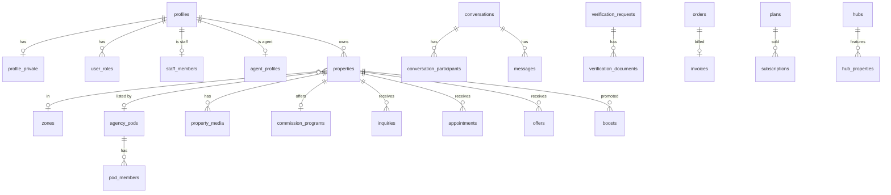

# DwellyProperty — Database Schema (Supabase / Postgres 17)

Migrations: `supabase/migrations/` · Seed (dev only): `supabase/seed.sql` · Tests: `tools/db-check` (`npm run check`)

## หลักการออกแบบ

1. **ทุกแถวมีเจ้าของเป็น user id** (ไม่ใช้ชื่อเป็นข้อความเหมือน prototype) ทำให้ RLS ทำงานได้
2. **RLS เปิดทุกตาราง** ผู้ใช้ทั่วไปเห็นเฉพาะข้อมูลสาธารณะและข้อมูลของตัวเอง ส่วน staff เห็นตามบทบาท
3. **Guard trigger** ป้องกันการแก้ฟิลด์ที่ผู้ใช้ไม่ควรแก้ได้ เช่น `is_verified`, `status`, ตัวนับ, ราคาในข้อเสนอ และบังคับลำดับสถานะ (state machine) ของประกาศ ข้อเสนอ และนัดหมาย
4. **การตัดสินใจของ admin ทำผ่าน RPC** (`admin_*`) ทุกครั้งตรวจบทบาท staff, บันทึก `audit_logs` และส่ง `notifications` ให้ผู้เกี่ยวข้อง
5. **ข้อมูลติดต่อ (PDPA)** แยกไว้ใน `profile_private` ผู้อื่นเห็นเบอร์ผ่าน `reveal_listing_contact()` ได้เท่านั้น ซึ่งต้องล็อกอินและระบบบันทึก event ทุกครั้ง
6. **เงิน**: ราคาดึงจาก catalogue ฝั่ง server (`create_order`) และยืนยันการชำระด้วย webhook ผ่าน `fulfill_order` (service role เท่านั้น, เรียกซ้ำได้โดยไม่เกิดผลซ้ำ)

## ตาราง (40 ตาราง ใน 7 โดเมน)

| โดเมน | ตาราง |
|---|---|
| Users & staff | `profiles`, `profile_private`, `user_roles` (หลาย role ต่อคน), `staff_members`, `audit_logs`, `app_settings` |
| Listings | `zones`, `properties`, `property_media`, `favorites`, `saved_searches`, `property_events` |
| Deals & messaging | `inquiries` (leads), `appointments`, `offers`, `conversations`, `conversation_participants`, `messages`, `notifications` |
| Trust | `agent_profiles`, `agency_pods`, `pod_members`, `verification_requests`, `verification_documents`, `reviews`, `reports`, `commission_programs`, `commission_access_requests` |
| Content | `hubs`, `hub_properties`, `activities`, `activity_registrations` |
| Billing | `plans`, `subscriptions`, `boost_products`, `boosts`, `orders`, `invoices` |
| Compliance | `consents`, `account_deletion_requests` |



## State machines

**Listing** (`properties.status`)
```
draft ──owner──▶ pending_review ──moderator──▶ active ──owner──▶ reserved ──▶ sold / rented
  ▲                  │ reject (ต้องมีเหตุผล)        │ expires_at (cron)          
  └──── rejected ◀───┘                            ▼                           
              ▲  takedown                       expired ──owner──▶ pending_review (ส่งตรวจใหม่)
              └── active                      (owner ปิดเป็น archived ได้ทุกเมื่อ)
```

**Offer**: `pending →(seller) accepted | rejected | countered`, `countered →(buyer) accepted | rejected`, `pending|countered →(buyer) withdrawn`, หมดเวลา `valid_until` แล้วเป็น `expired` (cron)

**Appointment**: `pending →(seller) confirmed | declined`, `confirmed →(seller) completed | no_show`, ทั้งสองฝ่ายยกเลิกได้ ผู้ซื้อเลื่อนเวลาได้ระหว่าง `pending` และต้องนัดล่วงหน้าอย่างน้อย 1 ชั่วโมง

**Verification**: `pending →(verifier) approved | rejected | needs_info`, `needs_info →(user) pending` เมื่ออนุมัติจะตั้งค่า badge ให้อัตโนมัติ (`is_kyc_verified` / `license_verified` / `properties.is_verified`)

## บทบาท Staff (RBAC)

| role | สิทธิ์ |
|---|---|
| `super_admin` | ทุกอย่าง และจัดการ staff กับ settings |
| `moderator` | อนุมัติ/ระงับประกาศ, จัดการ zones/hubs/activities, จัดการ reports และรีวิว, อนุมัติสิทธิ์ commission |
| `verifier` | ตรวจ KYC, โฉนด, ใบอนุญาตนายหน้า และ Pod |
| `support` | ดูข้อมูลผู้ใช้และดีลเพื่อช่วยเหลือ, ระงับ/แบนผู้ใช้, จัดการ reports และคำขอลบบัญชี |
| `finance` | plans, boost products, orders, invoices |

## RPC หลักที่แอปเรียกใช้

| ฟังก์ชัน | ใครเรียก | หน้าที่ |
|---|---|---|
| `track_property_view(id)` | ทุกคน | นับยอดเข้าชม (ผู้ใช้ที่ล็อกอินนับ 1 ครั้งต่อชั่วโมง) |
| `reveal_listing_contact(id)` | ผู้ใช้ที่ล็อกอิน | แสดงเบอร์ผู้ขายและบันทึก event |
| `start_conversation(property_id, other_user)` | ผู้ใช้ | หาหรือสร้างห้องแชท 1:1 |
| `list_conversations()` | ผู้ใช้ | inbox พร้อมจำนวนข้อความที่ยังไม่อ่าน |
| `create_order(kind, plan, boost, property)` | ผู้ใช้ | สร้างคำสั่งซื้อโดยดึงราคาจาก catalogue |
| `fulfill_order(order, provider, ref)` | service role (webhook) | ยืนยันการจ่ายเงิน → เปิด subscription หรือ boost |
| `my_consents()`, `export_my_data()` | ผู้ใช้ | PDPA |
| `admin_review_listing`, `admin_takedown_listing`, `admin_feature_listing` | moderator | จัดการประกาศ |
| `admin_review_verification` | verifier | ตรวจเอกสาร |
| `admin_set_user_status` | support | ระงับหรือแบนผู้ใช้ (แบนแล้วซ่อนประกาศทั้งหมด) |
| `admin_resolve_report`, `admin_review_pod`, `admin_set_staff`, `admin_dashboard_stats` | staff | งานหลังบ้าน |
| `run_maintenance()` | pg_cron ทุกชั่วโมง | หมดอายุประกาศและข้อเสนอ, เตือนก่อนหมดอายุ, อัปเดตสถานะ hubs และ subscriptions |

## Storage buckets

| bucket | public | path | ใครอ่านได้ |
|---|---|---|---|
| `avatars` | ✓ | `{uid}/...` | ทุกคน |
| `property-media` | ✓ | `{uid}/{property_id}/...` | ทุกคน |
| `verification-docs` | ✗ | `{uid}/{request_id}/...` | เจ้าของไฟล์ + verifier |
| `chat-attachments` | ✗ | `{uid}/{conversation_id}/...` | สมาชิกในห้องแชท |

## ยังไม่ได้ทำ (เฟสถัดไป)
- แจ้งเตือนผ่าน LINE OA / email / push (ตาราง `notifications` เป็นแหล่งข้อมูล ต่อด้วย Edge Function + Database Webhook)
- ค้นหาตามรัศมีแบบ PostGIS (ตอนนี้ใช้ bounding box จาก `lat`/`lng`)
- เชื่อม payment gateway จริง (Omise / 2C2P) เพื่อเรียก `fulfill_order`
- ขั้นตอนลบบัญชีจริงหลังผ่าน `account_deletion_requests` (anonymize ข้อมูลแล้วลบ `auth.users`)
